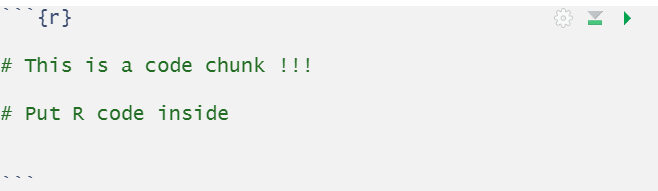
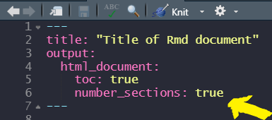
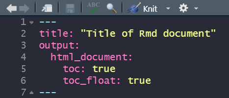
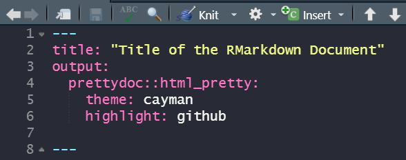

```{r parameters, echo=FALSE}
library(emo)


```


background-image: url(picture/jonathan-kemper.jpg)
background-position: 50% 50%
class: center, middle


```{r, echo = F}

GomoGomonoMi::use_gomo()
GomoGomonoMi::gomo_gomo_no("About", animation = "shakeX", repeating = 3)

```
---


+ ## `r icon::fa(name = "chrome", size = 3)` https://ihaddadenfodil.com/

+ ## `r icon::fa(name = "twitter", size = 3)` @moh_fodil


---


background-image: url(picture/jonathan-kemper.jpg)
background-position: 50% 50%
class: center, middle


```{r, echo = F}

GomoGomonoMi::use_gomo()
GomoGomonoMi::gomo_gomo_no("RMarkdown", animation = "shakeX", repeating = 3)

```


---


## A package developed by __Yihui Xie__

+ ## Reproducibility

+ ## Automation 

+ ## Collaboration 

+ ## Integration


---


# Highly recommended talk !

<center>

<iframe width="600" height="400" src="https://www.youtube.com/embed/s9aWmU0atlQ" frameborder="0" allow="accelerometer; autoplay; encrypted-media; gyroscope; picture-in-picture" allowfullscreen></iframe>

</center>


---

background-image: url(picture/jonathan-kemper.jpg)
background-position: 50% 50%
class: center, middle


```{r, echo = F}

GomoGomonoMi::use_gomo()
GomoGomonoMi::gomo_gomo_no("RMarkdown Anatomy", animation = "shakeX", repeating = 3)

```


---

# Structure of an Rmd document 


+ #`r emo::ji("star")` : Yaml (Metadata)

+ # `r emo::ji("star")`: Text

+ # `r emo::ji("star")`: code chunks


---
class: center, middle, inverse

# I. Markdown 


---

# 1. Markdown Syntax
<hr>

<br><br>

# I'm aware that _RMarkdown_ is __more__ than just `R + Markdown` 


---

# 2. Images 

######https://ih1.redbubble.net/image.543355849.2004/flat,750x,075,f-pad,750x1000,f8f8f8.jpg

<center>


---

## 2.1. The `include_graphics()` function


```{r include-graphic, echo=TRUE, out.width= "40%", fig.align='center'}

picture_path <- "https://ih1.redbubble.net/image.543355849.2004/flat,750x,075,f-pad,750x1000,f8f8f8.jpg"

knitr::include_graphics(path = picture_path)

```
---
class: center, middle

# `r emo::ji('voltage')``r emo::ji('voltage')` Help - Markdown Quick Reference


---

class: center, middle, inverse 

# Styling the Markdown !


---

background-image: url(picture/jonathan-kemper.jpg)
background-position: 50% 50%
class: center, middle


```{r, echo = F}

GomoGomonoMi::use_gomo()
GomoGomonoMi::gomo_gomo_no("RMarkdown", animation = "shakeX", repeating = 3)

```

---

# RMarkdown `r  emo::ji('love')` Code + Text 

+ ## This is possible with code chunks 




---

class: center

# But wait !!!

# Only R code ? 


--- 

---

class: center, middle

#R, Python, SQL, Julia, C++, JavaScript, Stan ... 

####`names(knitr::knit_engines$get())`


---


background-image: url(picture/jonathan-kemper.jpg)
background-position: 50% 50%
class: center, middle


```{r, echo = F}

GomoGomonoMi::gomo_gomo_no("R chunk", animation = "shakeX", repeating = 3)

```

---


```{r raw-plot}
library(ggplot2)

ggplot(mpg, aes(hwy)) + 
  geom_histogram(fill = "blue")

```


---
class: center, middle, inverse 

# Remove Messages and Warnings

---


```{r message-warning, warning=FALSE, message=FALSE}

ggplot(mpg, aes(hwy)) + 
  geom_histogram(fill = "blue")

```


---


class: center, middle, inverse 

# Modifying the size of the Plot

---

```{r plot-size, warning=FALSE, message=FALSE, out.height="50%", out.width="50%"}

ggplot(mpg, aes(hwy)) + 
  geom_histogram(fill = "blue")

```

---

```{r plot-size2, warning=F, message=F, fig.height= 5, fig.width=5}

ggplot(mpg, aes(hwy)) + 
  geom_histogram(fill = "blue")


```

---

class: center, middle, inverse 

# Plot position

---

```{r plot-positio, warning=F, message=F, fig.height= 5, fig.width=5, fig.align='center'}

ggplot(mpg, aes(hwy)) + 
  geom_histogram(fill = "blue")


```


---


class: center, middle, inverse 

# Hide the code

---

# hwy distrbution (mpg data frame)


```{r code-hide, warning=F, message=F, fig.height= 5, fig.width=5, fig.align='center', echo=FALSE}

ggplot(mpg, aes(hwy)) + 
  geom_histogram(fill = "blue")

```


---


class: center, middle, inverse 

# Toggle the code appearance


---

## hide/show the code (like a Notebook !)


---

class: center, middle, inverse 

# Multiple Figures in Multiple Columns

---

```{r several-figures, out.width=c('50%', '50%'), fig.show='hold', fig.cap="distribution of hwy and cty variable", message=F, warning=F, echo=FALSE}


ggplot(mpg, aes(hwy)) +
  geom_histogram()

ggplot(mpg, aes(cty)) +
  geom_histogram()


```


---

class: center, middle, inverse 

# Show the code, hide the plot

---


# How to plot the hwy variable distribution. 

```{r plot-hide, warning=F, message=F, fig.height= 5, fig.width=5, fig.align='center', eval=FALSE}

ggplot(mpg, aes(hwy)) + 
  geom_histogram(fill = "blue")

```


---

background-image: url(picture/jonathan-kemper.jpg)
background-position: 50% 50%
class: center, middle


```{r, echo = F}

GomoGomonoMi::gomo_gomo_no("Tables in RMarkdown", animation = "shakeX", repeating = 3)

```


---

class: center, middle, inverse 

# Raw table output

---


```{r message=FALSE, warning=FALSE}

head(mpg)


```

---

class: center, middle, inverse 

# kable function 


---


```{r, eval=FALSE}
library(knitr)

kable(head(mpg))

```


```{r, echo=FALSE}

knitr::kable(head(mpg))

```

---


```{r, eval=FALSE}
library(knitr)

kable(x = head(mpg), 
      caption = "An overview of the mpg data frame")
```


```{r, echo=FALSE}

knitr::kable(x = head(mpg), 
             caption = "An overview of the mpg data frame")

```


---

class: center, middle, inverse 

# More with kableExtra 


---


```{r, eval=FALSE}
library(kableExtra)

head(mpg) %>% 
  kable(align = "c") %>% 
  column_spec(1:2, color = "#90170E",
              background = "lightblue", 
              bold = T) %>% 
  footnote(general = "kableExtra is awesome")

```


```{r echo=FALSE, message=FALSE, warning=FALSE}
library(kableExtra)


head(mpg) %>% 
  kable(align = "c") %>% 
  column_spec(1:2, 
              color = "#90170E",
              background = "lightblue", 
              bold = T) %>% 
  footnote(general = "kableExtra is awesome")
  
```


---


background-image: url(picture/jonathan-kemper.jpg)
background-position: 50% 50%
class: center, middle


```{r, echo = F}

GomoGomonoMi::gomo_gomo_no("Table of Content (toc)", animation = "shakeX", repeating = 3)

```

---

## Inserting a Table of Content 


--


## Inserting a Table of Content with Numbering 





---

## Inserting a Floating Table of Content



---
## Controlling the position of the TOC 


&lt;script&gt;

$(function() {
    $( "#TOC" ).insertAfter( $( "#table-of-contents" ) );
  });
  
&lt;/script&gt;


---

background-image: url(picture/jonathan-kemper.jpg)
background-position: 50% 50%
class: center, middle


```{r, echo = F}

GomoGomonoMi::gomo_gomo_no("RMarkdown Themes", animation = "shakeX", repeating = 3)

```


---


## The {prettydoc} package
######https://github.com/yixuan/prettydoc

### A "lightweight yet nice-looking theme for R Markdown"

### Déveloped by Yixuan Qiu




---

background-image: url(picture/jonathan-kemper.jpg)
background-position: 50% 50%
class: center, middle


```{r, echo = F}

GomoGomonoMi::gomo_gomo_no("Tips", animation = "shakeX", repeating = 3)

```


---

# An R Script is an Rmd Document !!!
***

## knitr::spin("script.R", knit = F, format = "Rmd")

<center> 
<br> 


---

# An Rmd Document is an R Script !!!
***

## knitr::purl("Rmd_Intro.Rmd")


<center>
<br>


---


<center>

<br>


